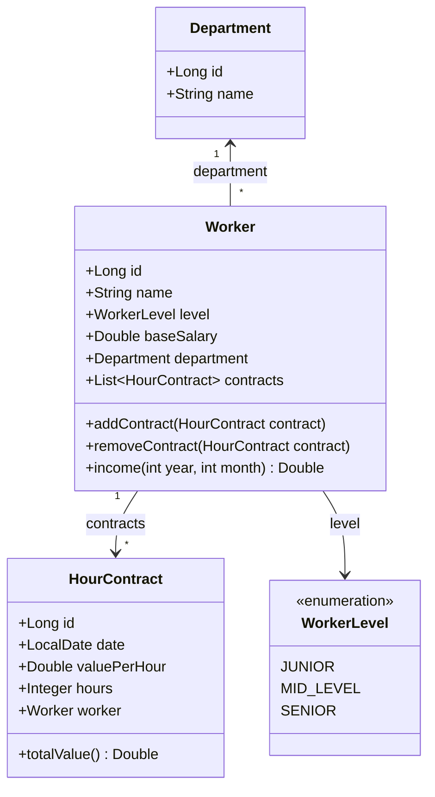

# Worker Contracts System (Sistema de Contratos de Trabalhadores)

> **Projeto desenvolvido durante o curso de Java do professor Nélio Alves.**

Este projeto é uma aplicação desenvolvida com **Java** e **Spring Boot**, aplicando conceitos fundamentais de Orientação a Objetos (composição de objetos, enumerações) integrados ao **Spring Data JPA** e persistência com banco de dados em memória **H2**.

---

## Sobre o Projeto

O objetivo do sistema é modelar o domínio de trabalhadores de uma empresa, seus respectivos departamentos e o registro de múltiplos contratos por hora associados a cada trabalhador. 

A aplicação realiza cálculos salariais dinâmicos considerando o salário base mais os ganhos gerados pelos contratos em um determinado mês e ano especificados.

---

## Modelo de Domínio e Relacionamentos



### 1. Entidades Principais

- **`Department` (`tb_department`)**: Representa o departamento em que o trabalhador atua (ex.: *Design*).
- **`Worker` (`tb_worker`)**: Entidade central que possui nome, nível de senioridade (`WorkerLevel`), salário base e referências ao seu departamento e à sua lista de contratos.
- **`HourContract` (`tb_hour_contract`)**: Representa um contrato de prestação de serviços por hora, contendo data (`LocalDate`), valor por hora (`valuePerHour`) e quantidade de horas trabalhadas (`hours`).
- **`WorkerLevel`**: Enumeração com os níveis de senioridade (`JUNIOR`, `MID_LEVEL`, `SENIOR`).

---

## Regras de Negócio e Métodos

### ➕ Adição e Remoção de Contratos
A classe `Worker` possui métodos utilitários para manter a consistência do relacionamento bidirecional entre `Worker` e `HourContract`:
- **`addContract(HourContract contract)`**: adiciona o contrato à lista interna do trabalhador e vincula o trabalhador ao contrato (`contract.setWorker(this)`).
- **`removeContract(HourContract contract)`**: desvincula o contrato da lista e remove a referência do trabalhador (`contract.setWorker(null)`).

### Cálculo de Renda Mensal (`income`)
O método `income(int year, int month)` calcula a remuneração total do trabalhador para um mês/ano específico:
$$\text{Income} = \text{Salário Base} + \sum (\text{Valor por Hora} \times \text{Horas dos contratos do mês/ano informado})$$

```java
public Double income(int year, int month) {
    double sum = baseSalary;
    for (HourContract c : contracts) {
        if (c.getDate().getYear() == year && c.getDate().getMonthValue() == month) {
            sum += c.totalValue();
        }
    }
    return sum;
}
```

---

## Persistência e Banco de Dados (Spring Data JPA)

- **Banco de Dados**: Utiliza o banco de dados em memória **H2** (`jdbc:h2:mem:testdb`), ideal para desenvolvimento e testes rápidos.
- **Mapeamento Objeto-Relacional (JPA/Hibernate)**:
  - O relacionamento entre `Worker` e `HourContract` está mapeado com `@OneToMany(mappedBy = "worker", cascade = CascadeType.ALL, orphanRemoval = true)`.
  - A anotação `cascade = CascadeType.ALL` garante que qualquer operação de persistência (como criar ou atualizar o `Worker`) propague automaticamente as alterações para a tabela de contratos (`tb_hour_contract`).
- **Repositórios**:
  - `DepartmentRepository` (estende `JpaRepository<Department, Long>`)
  - `WorkerRepository` (estende `JpaRepository<Worker, Long>`)

### Povoamento Inicial de Dados (Seeding)
A classe `SeedingConfig` implementa `CommandLineRunner` e, anotada com `@Transactional`, povoa automaticamente o banco de dados na inicialização da aplicação:
- Cria e salva um departamento (`Design`).
- Cria e salva um trabalhador (`Alex`, `MID_LEVEL`, salário base `1200.0`).
- Associa 3 contratos com diferentes datas e valores.
- Graças ao `@Transactional` e à entidade gerenciada com `CascadeType.ALL`, as alterações são sincronizadas e persistidas de forma atômica no banco de dados.

---

## Tecnologias Utilizadas

- **Java**
- **Spring Boot**
- **Spring Data JPA**
- **H2 Database Engine**
- **Maven**

---

## Como Executar o Projeto

### Pré-requisitos
- JDK instalado (versão compatível configurada no projeto)
- Maven (ou utilizar o wrapper `./mvnw` incluso)

### Executando a aplicação
Clone o repositório e execute no terminal:

```bash
./mvnw spring-boot:run
```

### Acessando o Console do H2
Com a aplicação em execução:
1. Abra no navegador: [http://localhost:8080/h2-console](http://localhost:8080/h2-console)
2. Preencha as credenciais:
   - **JDBC URL**: `jdbc:h2:mem:testdb`
   - **User Name**: `sa`
   - **Password**: *(em branco)*
3. Clique em **Connect** para visualizar as tabelas `TB_DEPARTMENT`, `TB_WORKER` e `TB_HOUR_CONTRACT` e consultar os dados inseridos.
